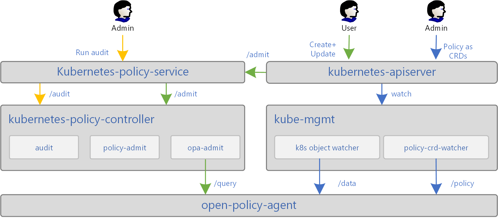

# Kubernetes policy design

## Use Cases

There are three basic scenarios for the policy control 

* Admission: Any Create/Update operation should be regulated by policy deployed by the administrator of the cluster
* Authorization: Any request to the APIServer should be regulated by policy deployed by the administrator of the cluster
* Audit: Administrator of the cluster should be able to evaluate the current state of the cluster 

## Personas

* Admin: Administrator of the cluster who also installs the policies for the cluster. The administrator also runs audits on the cluster.  
* User: Consumer of the kubernetes api.  

## Components

The following are basic components of policy controller at the cluster level



### gatekeeper

This is a kubernetes service which exposes the `audit`, `admit` and `authorize` TLS http methods for the cluster. The `admit` functionality is used as `MutatingWebhookConfiguration` by the kubernetes apiserver. The `audit` functionality exposes the current evaluation state of the cluster. In addition the controller is responsible to validate the correctness of the policies that are being added for the cluster e.g. checking for conflicting patches; making sure that the policies are valid `rego` documents. The `authorize` functionality can be used as [webhook authorization module](https://kubernetes.io/docs/reference/access-authn-authz/authorization/#authorization-modules). In this case the APIServer sends a SubjectAccessReview for every request made to the APIServer to kubernetes policy controller and the controller can deny these requests based on OPA policies. 

Note > If OPA service is unavailable it should return deny to the api-server.

The evaluation is a call to `OPA`. This call produces one or more decisions. Each decision is either an approve/deny (with a message) or a list of patches to be applied on the object which is being evaluated. In case of `authorize` there are no patches and only denies are propagated back to the APIServer. Generally, it's possible to allow request, to deny request or to delegate to the next authorization module. The kubernetes policy controller right now either denies requests or if requests are not denied it delegates to the next authorization module. Via this mechanism it's possible to implement a blacklist of API calls in front of the RBAC authorization module.    


### open-policy agent(OPA)

open-policy-agent(OPA) service is the policy engine for the kubernetes policy controller. It performs evaluations as called by `gatekeeper`. For our `audit` requirement OPA can not be used as a standalone. We also chose to use OPA as a service (instead of using as a lib) as it allows to

1. Decouple the kubernetes admission controller logic from the policy engine.
2. When needed, the policy engine can be hosted outside of the cluster.

### kube-mgmt

The primary functionality is to watch for kubernetes objects and policy CRDs and ensure eventual consistent state of OPA. This ensures that OPA is always evaluating against a fresh cached view of the cluster state.

## Policy

Policies are gates which are used to control the state of the cluster. Policies are modeled as CRDs. A single policy can be used for `validation` and for `mutation`. The same policy can be used in gating the api-server call via admission control and as offline audit by the user. This enables the user to validate new objects on the cluster and audit the state of the objects that were created before the policy deployment. The `authorization` policies are different because they cannot always be mapped to an individual resource and are more general, e.g. it's possible to deny non-resource requests or execs into specific pods (see also [Authorization Overview](https://kubernetes.io/docs/reference/access-authn-authz/authorization/#review-your-request-attributes)). 

### Policy Definition

Policies are expressed as `rego` document. A canonical example for a validation policy is as the following

```python
package admission

deny[{
    "id": "anyPolicyID",
    "resource": {"kind": kind, "namespace": namespace, "name": name},
    "resolution": {"message": "test always violate"},
}] {
    # deny all, match logic is omitted
    true
}
```

> The above example denies everything. And it does not describe the actual match logic.

Policy consists of:

* `id`: uniquely identifies a policy on a kubernetes cluster.
* `resource`: allows filtering on the resource the policy is targeting, this includes the `kind` which same as kubernetes definition of `kind` of the object,`namespace` is the namespace and name of the object being evaluated.
* `resolution`: the decision of a single opa policy query, consists of `message` and optionally `patches` .Note that the patch field is an array of JSON patch operations. This means a single policy can patch different parts of the object being evaluated.

### Examples

#### Admission

```python
package admission
# Patch any pod so that imagePullPolicy is Always
deny[{
    "id": "image-pull-policy",
    "resource": {"kind": "pods", "namespace": "front-end", "name": name},
    "resolution": resolution,
}] 
{
    matches[["pods", namespace, name, pod]]
    pod.spec.containers[i].imagePullPolicy != "Always"
    path := sprintf("spec/containers/%v/imagePullPolicy", [i])
    resolution = {
        "patches": [{"op": "replace",
                    "path": path,
                    "value": "Always"}],
        "message": "Change imagePullPolicy to Always"
  }
}
```

The above policy ensures that the container `imagePullPolicy` is always set to `Always` for any pod deployed into `front-end` namespace.

#### Authorization

````python
package authorization
# Deny execs to pods in kube-system
deny[{
 	"id": "exec-pods-kube-system-istio-system",
 	"resource": {"kind": "pods","namespace": namespace,"name": name},
 	"resolution": {"message": "Your're not allowed to exec/cp on Pods in kube-system & istio-system"},
}]
{
 	matches[["pods", namespace, name, resource]]
 
 	re_match("^(kube-system|istio-system)$", resource.spec.resourceAttributes.namespace)
 	resource.spec.resourceAttributes.verb = "create"
 	resource.spec.resourceAttributes.subresource = "exec"
}
````

The above policy ensure that `exec` requests for pods in `kube-system` and `istio-system` are denied.
